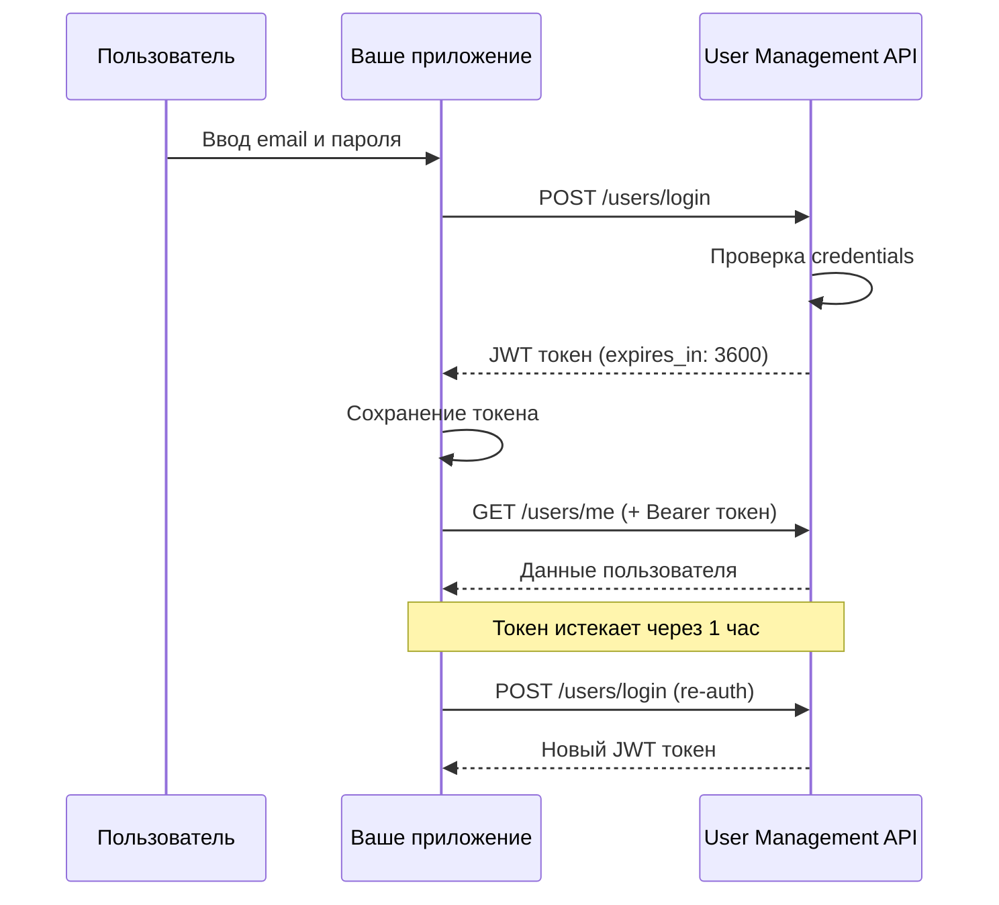

# API управления пользователями: руководство по быстрому старту

*Этот документ представляет собой **пошаговое руководство для быстрого освоения и интеграции основного функционала User Management API.** Мы описываем архитектурный стиль RESTful, используем JSON для обмена данными и фокусируемся на ключевых операциях: безопасной регистрации пользователей, аутентификации на основе JWT-токенов и управлении профилем. В руководстве приведены подробные примеры с использованием cURL и четкая структура обработки ошибок для минимизации времени на внедрение.*

## Содержание

- [Обзор](#обзор)
- [Требования](#требования)
- [Аутентификация](#аутентификация)
  - [API-ключ (для регистрации и администрирования)](#api-ключ-для-регистрации-и-администрирования)
  - [JWT-токен (для пользовательских операций)](#jwt-токен-для-пользовательских-операций)
  - [Срок действия токена](#срок-действия-токена)
- [Ваш первый запрос: регистрация пользователя](#ваш-первый-запрос-регистрация-пользователя)
  - [Endpoint](#endpoint)
  - [Заголовки запроса](#заголовки-запроса)
  - [Тело запроса](#тело-запроса)
  - [Примеры кода](#примеры-кода)
  - [Ответы API](#ответы-api)
- [Типичные сценарии использования](#типичные-сценарии-использования)
  - [1. Вход пользователя](#1-вход-пользователя)
  - [2. Получение профиля пользователя](#2-получение-профиля-пользователя)
  - [3. Обновление профиля пользователя](#3-обновление-профиля-пользователя)
  - [4. Удаление аккаунта пользователя](#4-удаление-аккаунта-пользователя)
- [Справочник по запросам и ответам](#справочник-по-запросам-и-ответам)
- [Обработка ошибок](#обработка-ошибок)
- [Ограничения частоты запросов](#ограничения-частоты-запросов)
- [Следующие шаги](#следующие-шаги)
- [Дополнительные ресурсы](#дополнительные-ресурсы)

## Обзор

API управления пользователями предоставляет **RESTful endpoints** для полного цикла управления учетными записями в вашем приложении. Архитектура API построена вокруг **ресурса** `/users`, обеспечивая полную поддержку CRUD-операций (Create, Read, Update, Delete) для работы с профилями. Основной механизм безопасности — **Bearer Authentication** на основе JWT-токенов.

**Базовый URL**: `https://api.example.com/v1`

Это руководство охватывает практические аспекты работы с API, включая:  
* **Регистрация**: cоздание новых учетных записей (`POST /users/register`).
* **Аутентификация**: получение токена доступа (`POST /users/login`).
* **Управление профилем**: просмотр, обновление и удаление собственных данных (`GET/PUT/DELETE /users/me`).

---

## Требования

Перед началом работы убедитесь, что у вас есть:

1. **Активный API-ключ.** [Зарегистрируйтесь](https://example.com/signup), чтобы получить ваш API-ключ. Он необходим для выполнения административных операций, например, для регистрации новых пользователей.
2. **Совместимый HTTP-клиент.** Вы можете использовать cURL, Postman (рекомендуется для быстрого тестирования) или любой язык программирования с поддержкой HTTP-запросов (например, Python Requests, JavaScript Fetch API).
3. **Технические требования к среде**:
  * Поддержка **HTTPS/TLS 1.2** или выше для обеспечения безопасности передачи данных.
  * Все запросы и ответы используют кодировку **UTF-8**.
4. **Базовое понимание:**
   * Принципов **REST API** и использования стандартных **HTTP-методов** (`GET, POST, PUT, DELETE`).
   * Формата обмена данными **JSON**.

<p align="right"><a href="#содержание">⬆️ Наверх</a></p>

---

## Аутентификация

API использует гибридный подход к аутентификации, чтобы обеспечить разделение прав между административными задачами (например, регистрация пользователей) и операциями, выполняемыми самим пользователем (например, обновление профиля).

Этот API использует статический API-ключ для административных операций и JWT-токены для пользовательских операций, основанных на сеансе.

### API-ключ (для регистрации и администрирования)
API-ключ используется для идентификации клиента (вашего приложения) и предоставления ему права на выполнение таких действий, как регистрация новых пользователей.
* **Получение**: ключ выдается [после регистрации](https://example.com/signup) приложения на портале разработчика.
* **Использование**: ключ должен быть включен в каждый административный запрос через специальный заголовок `X-API-Key`.

```
X-API-Key: ваш_статический_api_ключ_1a2b3c
```

> ⚠️ Примечание по безопасности. API-ключ следует хранить на стороне сервера и никогда не раскрывать в клиентском коде (браузере или мобильном приложении).

### JWT-токен (для пользовательских операций)
После успешного входа в систему `(POST /users/login)` пользователю выдается JSON Web Token (JWT), который служит для аутентификации в течение текущей сессии.
* **Получение**: токен возвращается в теле ответа после успешного входа.
* **Использование**: токен должен быть передан в заголовке `Authorization` с использованием схемы **Bearer Authentication** во всех последующих запросах, связанных с профилем пользователя.

```
Authorization: Bearer ваш_jwt_токен_eyJhbGciOiJIUzI1NiIsInR5cCI6IkpXVCJ9...
```

### Срок действия токена
Токен имеет ограниченный срок действия:

|Поле|Значение|Описание|
|-----|-----|----|
|expires_in  |3600   |  Срок жизни токена в секундах (1 час).|
|token_type| Bearer |Используемая схема аутентификации.|

По истечении срока действия токена API вернет ошибку `401 Unauthorized`. В этом случае клиенту необходимо запросить новый токен, повторно аутентифицировав пользователя.

### Процесс аутентификации



*Диаграмма показывает полный цикл аутентификации от входа до повторной авторизации при истечении токена.*

<p align="right"><a href="#содержание">⬆️ Наверх</a></p>

---

## Ваш первый запрос: регистрация пользователя

Давайте зарегистрируем вашего первого пользователя, выполнив запрос к ресурсу `/users/register`. Для этой операции требуется ваш **API-ключ**.

### Endpoint

```
POST /users/register
```

### Заголовки запроса

Для корректной обработки запроса необходимо передать следующие заголовки:

|Заголовок|	Значение|	Описание|	Обязательный|
|---|----|----|---|
|Content-Type|	application/json|	Указывает, что тело запроса передается в формате JSON.|	Да|
|X-API-Key|	ваш_api_ключ|	Ваш уникальный ключ для аутентификации административных операций.|	Да|

### Тело запроса
Передайте учетные данные нового пользователя в формате JSON.

```json
{
  "username": "ivan_petrov",
  "email": "ivan@example.com",
  "password": "BezopasnyParol123!",
  "full_name": "Иван Петров"
}
```

### Примеры кода
**1. Использование cURL (Командная строка)**

```bash
curl -X POST https://api.example.com/v1/users/register \
  -H "Content-Type: application/json" \
  -H "X-API-Key: ваш_api_ключ" \
  -d '{
    "username": "ivan_petrov",
    "email": "ivan@example.com",
    "password": "BezopasnyParol123!",
    "full_name": "Иван Петров"
  }'
```

**2. Использование JavaScript (Fetch API)**

```JavaScript
const registrationData = {
  username: "ivan_petrov",
  email: "ivan@example.com",
  password: "BezopasnyParol123!",
  full_name: "Иван Петров"
};

fetch('https://api.example.com/v1/users/register', {
  method: 'POST',
  headers: {
    'Content-Type': 'application/json',
    'X-API-Key': 'ваш_api_ключ'
  },
  body: JSON.stringify(registrationData)
})
  .then(response => response.json())
  .then(data => {
    console.log('Пользователь создан:', data.data.user_id);
  })
  .catch(error => {
    console.error('Ошибка регистрации:', error);
  });
```

**3. Использование Python (Requests)**
```python
import requests

registration_data = {
    "username": "ivan_petrov",
    "email": "ivan@example.com",
    "password": "BezopasnyParol123!",
    "full_name": "Иван Петров"
}

response = requests.post(
    'https://api.example.com/v1/users/register',
    headers={
        'Content-Type': 'application/json',
        'X-API-Key': 'ваш_api_ключ'
    },
    json=registration_data
)

if response.status_code == 201:
    user_data = response.json()
    print(f"Пользователь создан: {user_data['data']['user_id']}")
else:
    print(f"Ошибка: {response.json()['message']}")
```

### Ответы API

**Успешный ответ (HTTP-статус: `201 Created`)**

Успешное создание нового ресурса возвращает статус `201` и данные только что созданного пользователя, включая уникальный `user_id`.

```json
{
  "status": "success",
  "message": "Пользователь успешно зарегистрирован",
  "data": {
    "user_id": "usr_1a2b3c4d",
    "username": "ivan_petrov",
    "email": "ivan@example.com",
    "created_at": "2025-11-13T10:30:00Z"
  }
}
```

**Ошибка (400 Bad Request)**

Пример: повторная регистрация.

```json
{
  "status": "error",
  "message": "Email уже существует",
  "error_code": "EMAIL_EXISTS"
}
```

<p align="right"><a href="#содержание">⬆️ Наверх</a></p>

---

## Типичные сценарии использования

### 1. Вход пользователя

Аутентифицируйте существующего пользователя и получите JWT-токен.

**Endpoint:** `POST /users/login`

**Тело запроса:**

```json
{
  "email": "ivan@example.com",
  "password": "BezopasnyParol123!"
}
```

**Ответ (200 OK):**

```json
{
  "status": "success",
  "data": {
    "token": "eyJhbGciOiJIUzI1NiIsInR5cCI6IkpXVCJ9...",
    "expires_in": 3600,
    "user": {
      "user_id": "usr_1a2b3c4d",
      "username": "ivan_petrov",
      "email": "ivan@example.com"
    }
  }
}
```
> 💡 Следующие шаги: сохраните полученный token и используйте его в заголовке `Authorization` для всех последующих запросов, требующих аутентификации.

### 2. Получение профиля пользователя

Получите информацию о профиле текущего аутентифицированного пользователя.

**Endpoint:** `GET /users/me`

**Заголовки запроса:**

```
Authorization: Bearer ваш_jwt_токен
```

**Ответ (200 OK):**

```json
{
  "status": "success",
  "data": {
    "user_id": "usr_1a2b3c4d",
    "username": "ivan_petrov",
    "email": "ivan@example.com",
    "full_name": "Иван Петров",
    "created_at": "2025-11-13T10:30:00Z",
    "updated_at": "2025-11-13T10:30:00Z"
  }
}
```

### 3. Обновление профиля пользователя

Обновите информацию профиля текущего пользователя. Запрос идемпотентен: многократная отправка одних и тех же данных не приведет к изменению состояния ресурса.

**Endpoint:** `PUT /users/me`

**Заголовки запроса:**

```
Authorization: Bearer ваш_jwt_токен
Content-Type: application/json
```

**Тело запроса:**

В теле запроса необходимо передать все поля, которые вы хотите обновить. Непереданные поля останутся неизменными.

```json
{
  "full_name": "Иван Михайлович Петров",
  "phone": "+7-999-123-4567"
}
```

**Ответ (200 OK):**

```json
{
  "status": "success",
  "message": "Профиль успешно обновлен",
  "data": {
    "user_id": "usr_1a2b3c4d",
    "username": "ivan_petrov",
    "email": "ivan@example.com",
    "full_name": "Иван Михайлович Петров",
    "phone": "+7-999-123-4567",
    "updated_at": "2025-11-13T14:20:00Z"
  }
}
```

### 4. Удаление аккаунта пользователя

Безвозвратно удалите аккаунт текущего пользователя.

> **⚠️ Внимание:** Это действие нельзя отменить. Все данные пользователя будут безвозвратно удалены.

**Endpoint:** `DELETE /users/me`

**Заголовки запроса:**

```
Authorization: Bearer ваш_jwt_токен
```

**Ответ (200 OK):**

```json
{
  "status": "success",
  "message": "Аккаунт успешно удален"
}
```

<p align="right"><a href="#содержание">⬆️ Наверх</a></p>

---

## Справочник по запросам и ответам

### Поля объекта пользователя

| Поле | Тип | Описание | Обязательное | Ограничение/формат|
|------|-----|----------|--------------|--------|
|`user_id`|string|Уникальный ID пользователя, генерируется сервером| Нет (только в ответе)| UUIDv4|
| `username` | string | Уникальное имя пользователя | Да | 3-30 символов, только латиница и цифры, нижний регистр|
| `email` | string | Действующий email-адрес | Да | Соответствует стандарту RFC 5322, должен быть уникальным|
| `password` | string | Пароль (минимум 8 символов) | Да (при регистрации) | Минимум 8 символов, должен содержать 1 заглавную букву и 1 цифру|
| `full_name` | string | Полное имя пользователя | Нет | Максимум 100 символов|
| `phone` | string | Номер телефона в международном формате | Нет | Формат E.164 (`+7-XXX-XXX-XXXX`)|
|`created_at` |string |Дата и время регистрации | Нет (только в ответе)| Формат ISO 8601 (`YYYY-MM-DDTHH:mm:ssZ`)|

<p align="right"><a href="#содержание">⬆️ Наверх</a></p>

---

## Обработка ошибок

API использует стандартные HTTP-статусы для обозначения проблем и возвращает структурированный JSON-объект, содержащий код ошибки и описание.

### Распространенные коды ошибок

| HTTP-статус | Код ошибки | Описание | Решение |
|-------------|------------|----------|---------|
| 400 | `INVALID_INPUT` | Данные запроса некорректны | Проверьте обязательные поля и форматы |
| 401 | `UNAUTHORIZED` | Отсутствует или недействителен токен | Включите действующий JWT-токен в заголовок |
| 403 | `FORBIDDEN` | Недостаточно прав | Проверьте права API-ключа или токена |
| 404 | `USER_NOT_FOUND` | Пользователь не существует | Проверьте ID пользователя или учетные данные |
| 409 | `EMAIL_EXISTS` | Email уже зарегистрирован | Используйте другой email-адрес |
|429  |`TOO_MANY_REQUESTS`|Превышен лимит частоты запросов|См. раздел «Ограничения частоты запросов». Повторите запрос позже.|
| 500 | `INTERNAL_ERROR` | Ошибка сервера | Попробуйте позже или обратитесь в поддержку |

### Формат ответа с ошибкой

Все ошибки следуют этой структуре, где поле `details` предоставляет дополнительный контекст (например, название некорректного поля):

```json
{
  "status": "error",
  "message": "Описание ошибки для человека",
  "error_code": "КОД_ДЛЯ_МАШИНЫ",
  "details": {
    "field": "Дополнительный контекст об ошибке"
  }
}
```

<p align="right"><a href="#содержание">⬆️ Наверх</a></p>

---

## Ограничения частоты запросов

API применяет ограничения (Rate Limiting) для защиты от злоупотреблений и DDoS-атак.

|Операция|	Лимит|	Примечание|
|---|---|---|
|Регистрация (`/register`)|	10 запросов в час|	Лимит применяется к одному IP-адресу|
|Вход (`/login`)|	20 запросов в час|	Лимит применяется к одному IP-адресу для предотвращения атак подбора|
|Остальные endpoints|	1000 запросов в час|	Лимит применяется к каждому уникальному JWT-токену или API-ключу|

При превышении лимита вы получите ответ `429 Too Many Requests`.

<p align="right"><a href="#содержание">⬆️ Наверх</a></p>

---

## Следующие шаги

**Изучить дополнительно:**
* Двухфакторную аутентификацию (2FA)
* Интеграцию OAuth 2.0
* Работу с refresh токенами
* Batch операции (массовые запросы)

**Присоединиться к сообществу:**
* [Форум разработчиков](https://example.com/forum)
* [Telegram-чат API Support](https://t.me/example_api)
* [Stack Overflow Tag](https://stackoverflow.com/questions/tagged/example-api)

**Получить помощь:**
* Email поддержки: api-support@example.com
* [Портал технической поддержки](https://example.com/support)
* [Статус сервиса](https://status.example.com)

---

## Дополнительные ресурсы

**Примеры качественной API-документации:**
- [Stripe API Documentation](https://stripe.com/docs/api) — эталон API-документации
- [Auth0 Authentication Guide](https://auth0.com/docs) — лучшие практики аутентификации
- [Postman Learning Center](https://learning.postman.com/) — работа с API

**Полезные инструменты:**
- [JSONLint](https://jsonlint.com/) — валидация JSON
- [Postman](https://www.postman.com/) — тестирование API


---

**Вопросы или предложения?** Свяжитесь с нашей поддержкой разработчиков: api-support@example.com

---

<p align="right"><a href="#содержание">⬆️ Наверх</a></p>

*Последнее обновление: 17 ноября 2025. Данный документ является учебным.*
